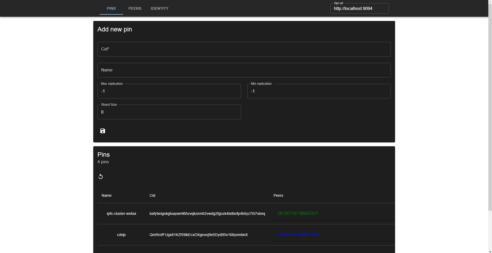

# IPFS Cluster WebUI

This is a very work in progress web ui for `ipfs-cluster-service`.

## What works right now?

1. You can see pins, peers, and identity
2. You can add new pins
3. You can update pins

## Getting started

### Prerequisites

The `service.json` file will have to have `restapi.cors_allowed_methods` with at least the values `["GET","POST"]`.
Or updating will not work.

### Running it

1. Clone this repository
2. install dependencies with `yarn install`
2. start the webui `yarn start`
